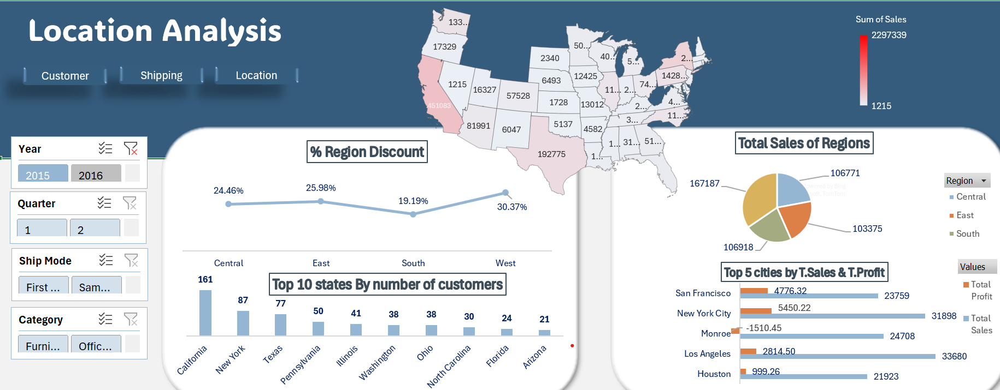
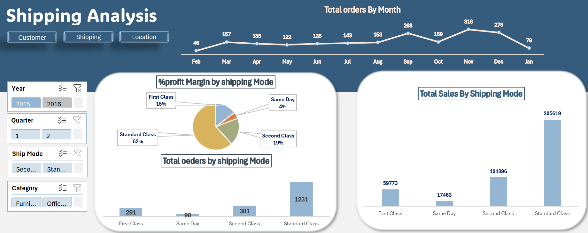

# 📊 Sales & Profitability Analytics Dashboard

An interactive and insightful Excel-based dashboard designed to monitor sales, costs, and profitability across products, regions, and customer segments. This dashboard empowers stakeholders to make data-driven decisions using key metrics, Power Query transformations, and Power Pivot modeling.

---

## 🧩 Overview

This dashboard project is built to provide clear visibility into profitability and sales performance across multiple business dimensions — including time, geography, product lines, and customer segments. Built using **Power Query** for data cleaning and transformation, and **Power Pivot** for advanced data modeling, it supports strategic planning by surfacing trends, uncovering inefficiencies, and highlighting best-performing areas.

---

## 🚀 Features

📌 Total Sales, Profit, and Margin KPIs  
📅 Sales & Profit Trends Over Time  
🌍 Region-wise Revenue and Profit Contribution  
🧾 Top 10 Products by Sales and Profit  
📉 Bottom 10 Products and Loss Leaders  
🏷️ Category & Segment Performance Breakdown  
📦 Cost Analysis and Revenue Comparison  
🔄 Interactive Filters (Slicers):  
  ▪ Year  
  ▪ Region  
  ▪ Product Category  
  ▪ Customer Segment  
  ▪ Product Name  

🛠 Built with:
- **Power Query** – for efficient data cleaning and preparation  
- **Power Pivot** – for DAX calculations and relationship modeling across multiple tables

---

## 📊 Charts and Their Purpose

| 📈 Chart Type | 📌 Purpose |
|--------------|------------|
| Line Chart (Monthly Trends) | Track overall revenue, cost, and profit progression over time |
| Bar Chart (Top 10 Products) | Visualize top-performing products by sales/profit |
| Horizontal Bar (Bottom Products) | Highlight underperformers and possible discontinuation targets |
| Pie Chart (Revenue by Region) | Understand which regions contribute most to total revenue |
| Stacked Bar (Category Margin %) | Compare profit margin across different product categories |
| KPI Cards | Quickly monitor Total Sales, Profit, Margin %, and COGS |

---

## 📈 Key Metrics (Sample)

- 💰 **Total Sales**: $81,015,212.09  
- 📦 **Total Quantity Sold**: 214,516  
- 📈 **Average Sale**: $1,329.88  
- 📊 **Profit Margin**: 37.8%  
- 🧮 **Total Orders**: 60,919  
- 🏷️ **Highest Sale (Single Order)**: $30,992.91  

---

## 🔍 Key Insights

✅ Mountain bikes and HL Mountain Frame models dominate in sales and profitability  
📉 Some categories (e.g., Shorts, Helmets) contribute low margins — potential for bundling or promotion  
🌍 North America leads in sales revenue and margin contribution  
👥 A small number of customers contribute disproportionately high revenue  
🚩 Certain customers generate less than $100 total sales — may require targeted engagement or churn analysis

---

## ✅ Recommendations

- **Inventory Optimization**: Focus stocking and marketing efforts on top-selling models (e.g., Mountain-100, HL Mountain Frame).  
- **Customer Targeting**: Engage low-value customers with feedback surveys or incentive programs.  
- **Regional Scaling**: Expand efforts in top-performing regions; North America shows strong ROI.  
- **Category Strategy**: Bundle low-margin items with popular ones or run clearance campaigns.  
- **Profitability Tracking**: Regularly monitor cost-heavy products with low margins for potential phase-out.

---

## 🖼️ Screenshot

🔻 **Full Dashboard Preview**    

---

## 📁 Files Included

- `Sales & Profitability Analytics Dashboard.xlsx` – Excel file with Power Query, Power Pivot, slicers, DAX metrics, and visuals  
- `README.md` – Project documentation and feature summary  

---

## 🛠 Tools & Technologies

- **Microsoft Excel** 
- 💡 **Power Query** – to clean and transform raw datasets efficiently  
- 🧠 **Power Pivot** – to build data models and write DAX formulas  
- 📊 Pivot Tables and Charts  
- 🎨 Conditional Formatting and Slicers  

---

## 📬 Contact

Have questions, suggestions, or want to collaborate?  
📨 Open an issue here on GitHub or connect with me on [LinkedIn](www.linkedin.com/in/nouran-yasser-582450280)  

---

⭐ If you find this dashboard useful, don't forget to **star** the repo!
